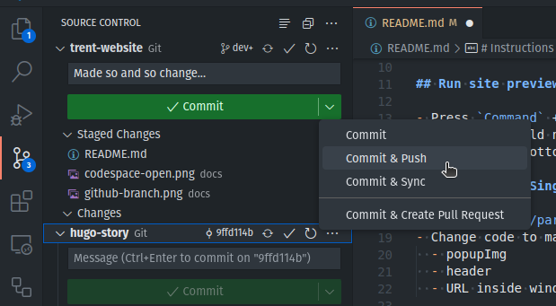

# Instructions

Change to the `dev` branch:

then open this repo using GitHub Codespaces:

## Run site preview

- Press `Command` + `Shift` + `B` and select `hugo: Serve site`.
- The site should now be running, and a popup to view it should appear in the bottom right.

## Change "New Single" popup

- Open `layouts/partials/template/scripts.html`
- Change code to match new single
  - popupImg
  - header
  - URL inside window.open

## Edit site data

- Data files are in the `data` folder
- `banner.yml` is the top section
- `gallery.yml` is the Singles section
- `items.yml` is the Press section
- etc

## Publishing

1. Stage and commit your changes and push to `dev` branch:

  
  

2. Wait for Netlify to build the site, then check [dev.trentvinemusic.com](https://dev.trentvinemusic.com/)
3. If all looks good, merge the `dev` branch into `main`:
    - Press `Command` + ` to open the Terminal
    - Run `git checkout main` to switch to the `main` branch
    - Run `git merge dev` to merge the `dev` branch into the `main` branch
    - Run `git push` to push the `main` branch up
    - Run `git checkout dev` to switch back to the `dev` branch for next time
4. Netlify will now build the main site
